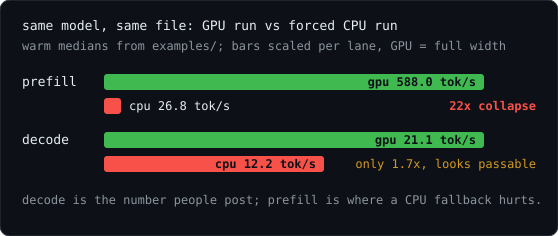
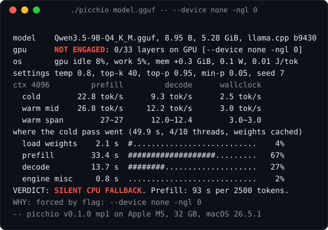

<div align="center">


<h1>picchio shows what produced your tok/s</h1>

<p>
<a href="https://github.com/logxio/picchio/actions/workflows/selftest.yml"></a>
<a href="LICENSE"></a>

</p>

<p><a href="#install">Install</a> · <a href="#commands-four-jobs-one-receipt">Commands</a> · <a href="#evidence-in-every-receipt">Evidence</a> · <a href="https://logxio.github.io/picchio/">Receipt Explorer</a> · <a href="#add-your-machine">Add your machine</a> · <a href="examples/">Examples</a></p>



</div>

I built Picchio to show what actually produced a local LLM number. It
measures the run and leaves one receipt with the model, engine settings,
GPU placement, prefill, decode, wall-clock throughput, memory and power.

- The same model and file measured **588.0 tok/s prefill and 21.1 tok/s
  decode on GPU**, but **26.8 and 12.2 on CPU**. Losing the GPU cost
  prefill 22x while decode fell only 1.7x.
- Nine files from three model families carrying the `Q4_K_M` label
  measured **4.82 to 5.55 bits per weight**. Four 9B files alone
  measured 5.02, 5.02, 5.07 and 5.27 over their shared tensors.
- My forced-CPU run completed every request with 0/33 layers on the GPU.
  Picchio caught it by checking the engine's placement report against the
  operating system's GPU meter.

[Browse the receipts](https://logxio.github.io/picchio/). If Picchio catches
something on your machine, star the repository and [send me the receipt](#add-your-machine).

## Install

```sh
curl -fsSL https://raw.githubusercontent.com/logxio/picchio/main/public/picchio.pyz -o picchio
chmod +x picchio
./picchio
```

Run it with no arguments and it finds Ollama tags, local GGUF files and
models in the Hugging Face and LM Studio caches, then lets you pick one.
Picchio is one Python 3.9+ file, uses only the standard library, works with
llama.cpp or Ollama, and runs on macOS and Linux.

## Commands: four jobs, one receipt

### 1. Diagnose one run

```sh
./picchio model.gguf
./picchio qwen3.5:9b
./picchio http://127.0.0.1:8080
./picchio diagnose model.gguf --json
./picchio model.gguf --share row
```

Give it a GGUF path and it runs llama.cpp. Give it an Ollama tag and it
measures local Ollama. Give it a URL and it measures that running
llama-server. `diagnose --json` writes JSON to stdout and the verdict to
stderr. `--share line|row|post` writes a ready-to-paste result; for a local
file it also adds the tensor mix and effective bits per weight.

Real receipts: [llama.cpp on Metal](examples/healthy-metal.txt) ·
[Ollama](examples/ollama-qwen35.txt) ·
[running server](examples/server-endpoint.txt) ·
[CPU fallback](examples/cpu-fallback.txt)

### 2. Inspect the exact file

```sh
./picchio id model.gguf
./picchio plan model.gguf
```

`id` reports the GGUF tensor mix, effective bits per weight and stored
origin claims. `plan` tells you whether the model fits;
after the first measurement, it also estimates decode speed.

Real cards: [MoE identity](examples/id-35b.txt) ·
[four Q4_K_M files](examples/quantizers/) ·
[35B fit plan](examples/plan-35b.txt)

### 3. Watch a real setup

```sh
./picchio guard -- llama-completion -m model.gguf -ngl 99 -p "hello"
./picchio watch ollama --for 8 --json
./picchio monitor qwen3.5:9b
```

`guard` warns when layers land off the GPU. `watch` samples whole-GPU
activity beside a process or loaded Ollama model. `monitor` repeats probes
against Ollama or llama-server and flags a collapsed performance lane.

Real sessions: [guard](examples/guard-ngl0.txt) ·
[watch](examples/watch-ollama.txt) ·
[monitor](examples/monitor-ollama.txt)

### 4. Share or check the evidence

```sh
./picchio share verdict.txt --line
./picchio share verdict.txt --row
./picchio share verdict.txt --post
./picchio verify verdict.txt
./picchio compare before.txt after.txt
```

`share` turns a receipt into a comment line, Markdown row or post skeleton.
`--model` adds the model details and bits per weight. `verify` checks the
receipt for contradictions. `compare` shows the first configuration
difference before it compares the rates.

Real outputs: [three share formats](examples/share-modes.txt) ·
[forged block check](examples/verify-forged.txt) ·
[comparison](examples/compare.txt)

For context sweeps, cached-rate checks, post audits, resumable suites and
agent traces, run `./picchio --help`. The long-run artifact format is in
[docs/run-manifests.md](docs/run-manifests.md).

## Evidence in every receipt

### Inside the GGUF

`./picchio id` reports every tensor's ggml type, the total weight count and
the effective bits per weight.

Across the four Qwen3.5-9B files in this repository, one file also bundles
a 243M-parameter MTP head at q8_0 while another publishes that head
separately. The underlying tensor accounts and byte checks are in
[examples/quantizers/](examples/quantizers/).

### Three performance lanes

Picchio reports prompt prefill, token decode and end-to-end wall-clock
throughput as separate lanes.

<p align="center">

</p>

The chart uses the committed GPU and CPU receipts. Every bar is a warm
median, scaled within its own lane.

### Placement, settings and cost

Picchio reads placement from the engine and checks it against the OS GPU
meter. On macOS it uses `ioreg` and Apple energy counters without sudo.
On NVIDIA Linux it reads NVML. On AMD Linux it reads the amdgpu sysfs
counters without requiring ROCm.

The same block records engine sampling settings, GPU memory change, power,
decode energy per generated token and the source of every field.

<p align="center">

</p>

The `WHY` line reports the first proven cause. Conflicting engine and OS
evidence prints `CONFLICTING EVIDENCE`. `--keep-logs DIR` keeps the raw
engine output and sampled GPU curve.

## Measured

Every row below uses protocol `mp1`: roughly 770 prompt tokens, 128
generated tokens, three passes, first pass cold, and a unique nonce for
every pass. Warm columns are medians. Linked receipts and raw engine logs
live in [examples/](examples/) and [examples/raw/](examples/raw/).

| machine         | model, engine                       | protocol | prefill | decode | wallclock | verdict             |
|-----------------|-------------------------------------|----------|--------:|-------:|----------:|---------------------|
| Apple M5, 32 GB | Qwen3.5-9B Q4_K_M, llama.cpp b9430  | mp1      |   588.0 |   21.1 |      15.5 | HEALTHY             |
| Apple M5, 32 GB | same, forced CPU (0/33 layers)      | mp1      |    26.8 |   12.2 |       3.0 | SILENT CPU FALLBACK |
| Apple M5, 32 GB | qwen3.5:9b, Ollama 0.31.1           | mp1      |   490.4 |   17.9 |      14.4 | HEALTHY             |
| Apple M5, 32 GB | Qwen3.6-35B-A3B UD-Q4, llama.cpp    | mp1      |   787.3 |   34.4 |      19.1 | HEALTHY             |
| Apple M5, 32 GB | qwen3.6:35b-a3b, Ollama 0.31.1      | mp1      |   728.7 |   31.2 |      23.4 | HEALTHY             |
| RTX 4090, Linux | Qwen3.5-9B Q4_K_M, llama.cpp b9430  | mp1      |  6763.3 |  138.0 |      25.2 | HEALTHY             |
| RTX 5090, Linux | Qwen3.5-9B Q4_K_M, llama.cpp b0.2.0 | mp1      |  9135.9 |  226.4 |      57.3 | HEALTHY             |
| RTX 5090, Linux | Qwen3.5-9B Q4_K_M, llama.cpp Vulkan | mp1      |  6206.3 |  198.4 |      51.0 | HEALTHY             |
| RTX 5090, Linux | qwen3.5:9b, Ollama 0.32.15          | mp1      |  8614.7 |  193.5 |     153.9 | HEALTHY             |
| RTX 5090, Linux | Qwen3.8-27B UD-Q4, llama.cpp b0.2.0 | mp1      |  3364.4 |   81.5 |      25.3 | HEALTHY             |
| your machine    |                                     |          |         |        |           |                     |

I ran the same 9B on the RTX 5090 through
[CUDA](examples/linux-5090-cuda.txt),
[Vulkan](examples/linux-5090-vulkan-nonce.txt) and
[Ollama](examples/linux-5090-ollama-nonce.txt). The 27B run filled the
card at 15.8 GiB resident and 343 W
([receipt](examples/linux-5090-27b.txt)). On the M5, the 35B
mixture-of-experts model activates about 3B weights per token, while its
first pass still reads the 20.6 GiB file
([llama.cpp](examples/id-35b.txt) · [Ollama](examples/ollama-35b.txt)).

## Add your machine

```sh
./picchio MODEL --share row > verdict-row.md 2> verdict.txt
```

- [Submit a verdict](https://github.com/logxio/picchio/issues/new?template=verdict-report.md)
- [Report a wrong verdict](https://github.com/logxio/picchio/issues/new?template=misdiagnosis-report.md)

Paste the complete 16-line receipt. If Picchio gets the verdict wrong,
attach the `--keep-logs` output too—I want that report first.

## Evidence coverage

- llama.cpp and Ollama get the full verdict block on macOS and Linux.
  `watch` adds OS-side placement evidence for MLX, LM Studio and other
  running processes.
- The repository carries real Apple Silicon, NVIDIA CUDA and NVIDIA
  Vulkan receipts. On AMD Linux, Picchio reads the amdgpu sysfs meter.
- llama.cpp contributes per-layer placement and applied sampler settings.
  Ollama contributes its CPU/GPU weight-memory split. Every receipt names
  the source beside the field.
- Before judging a run, Picchio checks that the GPU is idle. The receipt
  prints the utilization and power reading it saw before pass one.
- A remote llama-server keeps engine-reported prefill and decode counters
  while wall-clock throughput includes the network path.

## Reproducibility and scripting

```sh
./picchio --selftest
./picchio --version
./picchio --help
```

The self-test replays the raw logs behind every committed receipt and
reproduces each verdict block line for line. Commands with `--json` write
stable machine output. Exit codes separate healthy runs, runs that could
not start, partial offload, CPU fallback and conflicting evidence.

Picchio writes one cache file under `~/.cache/picchio`. Measurement logs
are written only when you request `--keep-logs DIR`.

## License

[MIT](LICENSE)
