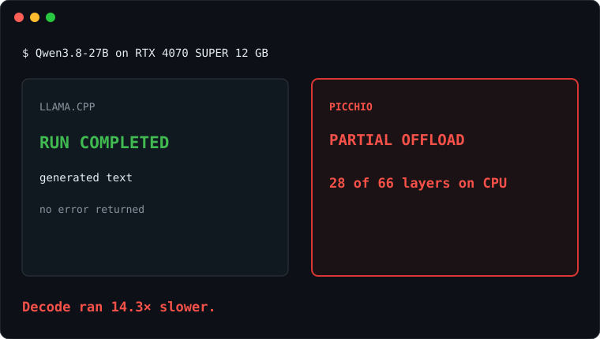

<div align="center">


<h1>catch local LLM CPU fallback before you trust tok/s</h1>

<p>
<a href="https://github.com/logxio/picchio/actions/workflows/selftest.yml"></a>
<a href="LICENSE"></a>

</p>

<p><a href="#run-it">Run it</a> · <a href="https://logxio.github.io/picchio/">Browse real results</a> · <a href="#send-me-your-machine">Add your machine</a></p>



</div>

**CPU FALLBACK: 0/33 layers on the GPU.** The same request returned **HTTP
200 OK** and generated text.

On the same Apple M5, with the same Qwen3.5-9B file:

| | GPU | silent CPU fallback |
|---|---:|---:|
| layers on GPU | 33/33 | 0/33 |
| prefill | 588.0 tok/s | 26.8 tok/s |
| decode | 21.1 tok/s | 12.2 tok/s |
| HTTP response | 200 | 200 |

The engine reported zero GPU layers. The operating system measured 0% GPU
work. Prefill fell from 588.0 to 26.8 tok/s.

## Run it

```sh
curl -fsSL https://raw.githubusercontent.com/logxio/picchio/main/public/picchio.pyz -o picchio
chmod +x picchio
./picchio
```

With no arguments, Picchio finds Ollama tags, local GGUF files and models in
the Hugging Face and LM Studio caches. Pick one and it runs three passes.

You can also point it straight at a model or a running server:

```sh
./picchio model.gguf
./picchio qwen3.5:9b
./picchio http://127.0.0.1:8080
```

It runs on macOS and Linux with Python 3.9+. The download is one file and
uses only the standard library.

## Use the result

| I want to… | Run |
|---|---|
| catch CPU fallback and measure the run | `./picchio MODEL` |
| guard something already running and get told the moment it leaves the GPU: your own command, a loaded model, a server | `./picchio guard -- COMMAND` · `./picchio guard ollama` · `./picchio guard http://127.0.0.1:8080` |
| compare two runs and show the first changed setting | `./picchio compare before.txt after.txt` |
| paste a compact result into an issue or post | `./picchio MODEL --share row` |

Add `--json` when you want machine-readable output.

## What it gives you

- the exact number of model layers on the GPU
- separate prefill, decode and wall-clock speeds
- GPU activity, memory, power and energy per generated token
- the first setting that changed when you compare two runs
- a clear `HEALTHY`, `CPU FALLBACK` or `PARTIAL OFFLOAD` result

## Compare real machines

I measured these with Picchio:

| machine | model and engine | placement | prefill | decode | wall-clock |
|---|---|---|---:|---:|---:|
| Apple M5 | Qwen3.5-9B, llama.cpp Metal | 33/33 | 588.0 | 21.1 | 15.5 |
| Apple M5 | same file, forced CPU | 0/33 | 26.8 | 12.2 | 3.0 |
| RTX 4090 | same file, llama.cpp CUDA | 33/33 | 6763.3 | 138.0 | 25.2 |
| RTX 5090 | same file, llama.cpp CUDA | 33/33 | 9135.9 | 226.4 | 57.3 |
| RTX 5090 | same file, llama.cpp Vulkan | 33/33 | 6206.3 | 198.4 | 51.0 |
| RTX 5090 | qwen3.5:9b, Ollama | 100% GPU | 8614.7 | 193.5 | 153.9 |
| your machine | | | | | |

[Open every result](https://logxio.github.io/picchio/) or compare the outputs
in [examples/](examples/).

## What Picchio reads

- llama.cpp: per-layer placement, applied sampling settings and timing
- Ollama: CPU/GPU weight split and timing
- macOS: Apple GPU activity, memory, power and energy per token
- NVIDIA Linux: GPU activity, memory, power and energy per token through NVML
- AMD Linux: GPU activity and memory through amdgpu sysfs. **AMD readings are reference-only for now. I am looking for real Radeon runs from the community; an AMD verdict block is the contribution I want most.**

Point Picchio at a GGUF path, an Ollama tag or a running llama-server URL.
The result tells you where the model ran and which number is safe to compare.

## Send me your machine

```sh
./picchio MODEL --share row > result.md 2> picchio.txt
```

[Add your result](https://github.com/logxio/picchio/issues/new?template=verdict-report.md).
If Picchio calls your run wrong, [send me that one first](https://github.com/logxio/picchio/issues/new?template=misdiagnosis-report.md).

## License

[MIT](LICENSE)
